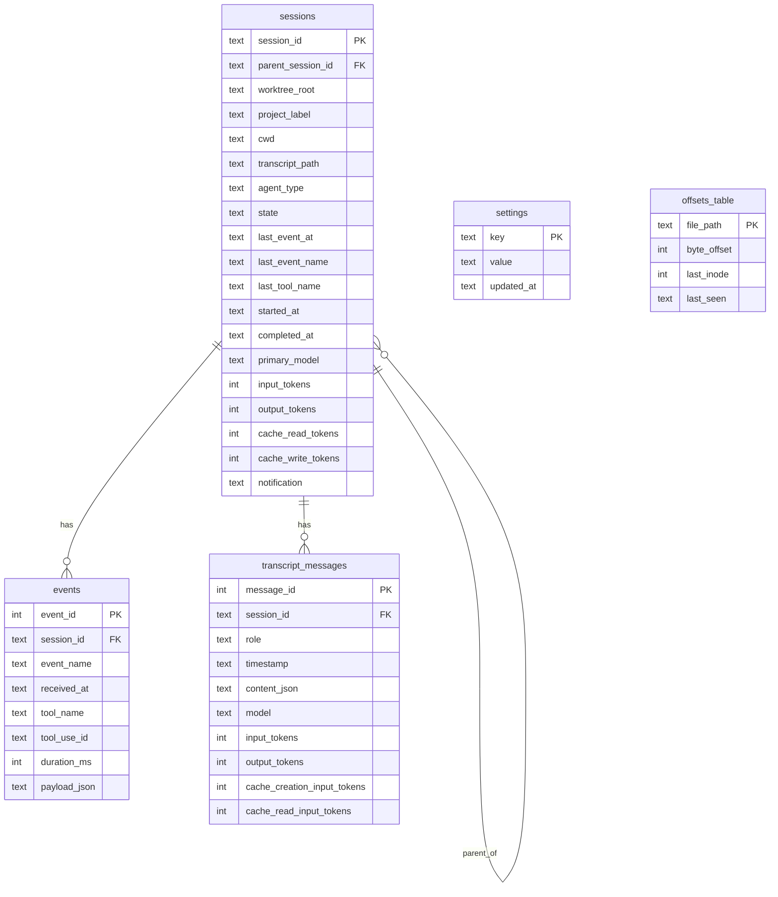
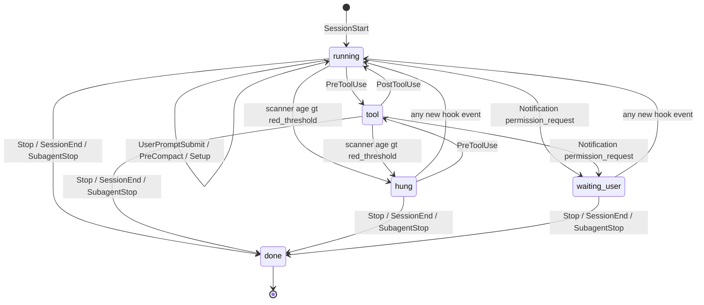

# Architecture — claude-sidecar-monitor

`csm` is a single-Mac observability collector for Claude Code agent sessions, paired with a mobile-first PWA dashboard. It answers three glance-questions from a phone: what is running, is anything hung, where are the tokens going. This is the outside-reader companion to [`spec.md`](spec.md): system layers, the request flow from hook to UI, the data model, the state machine, the two ingestion sources, agent-tree derivation, the encryption bootstrap, and what v0.1 deliberately omits.

## System layers

`csm` runs entirely on the user's Mac. Nothing is sent off the device except optional ntfy push notifications. The collector is a Python 3.12 + FastAPI process supervised by a user-level launchd LaunchAgent, listening on `127.0.0.1:8765`. The dashboard is a static React + Vite + Tailwind PWA shipped from the same FastAPI app. The phone reaches the dashboard over the user's tailnet via Tailscale Serve — no port forwarding, no public endpoint, end-to-end WireGuard.

```
┌──────────────────────────── macOS host ──────────────────────────────┐
│                                                                       │
│   shell / IDE / Augment Intent ─spawns─▶ claude (Claude Code CLI)     │
│                                  │                                    │
│              hook POSTs   ◀──────┤   JSONL writes                     │
│              (~50 ms)            │   (~1–3 s lag)                     │
│                                  ▼                                    │
│   ┌──────── csm collector (FastAPI · uv tool) ────────┐               │
│   │  hook receiver  /hook/<event>           (T6)      │               │
│   │  jsonl watcher  ~/.claude/projects      (T7)      │               │
│   │  hang scanner   asyncio · 5 s tick      (T8)      │               │
│   │  token aggregator  per-session + subtree (T9)     │               │
│   │  agent tree builder  task-edge match    (T10)     │               │
│   │  rest + sse  /api/* + /stream           (T11)     │               │
│   │  ntfy dispatcher  hang/done/wait        (T12)     │               │
│   │  static dashboard at /                  (T18)     │               │
│   │                                                   │               │
│   │  ┌────── in-process bus ─────────┐                │               │
│   │  │  asyncio fan-out (csm.bus)    │                │               │
│   │  │  kinds: session_update, event,│                │               │
│   │  │  transcript_message, hang,    │                │               │
│   │  │  settings_changed             │                │               │
│   │  └───────────────────────────────┘                │               │
│   │  ┌──── SQLCipher store ──────────┐                │               │
│   │  │  Argon2id KDF · key in        │                │               │
│   │  │  macOS Keychain (cached)      │                │               │
│   │  │  ~/Library/Application        │                │               │
│   │  │  Support/csm/store.db         │                │               │
│   │  └───────────────────────────────┘                │               │
│   └──────────────────┬────────────────────────────────┘               │
│                      │ Tailscale Serve (tailnet HTTPS)                 │
└──────────────────────┼────────────────────────────────────────────────┘
                       ▼
                📱 iPhone Safari → Add to Home Screen
                React PWA: live · tree · transcripts · tokens · settings
```

There are five logical layers, each with a single responsibility:

1. **Edge** — the shell hook script `~/.claude/hooks/csm-hook.sh` and the JSONL files that Claude Code writes per session. The edge is dumb: it forwards or appends. No timestamps, no parsing.
2. **Ingestion** — the hook receiver and the JSONL watcher. Both write to the same SQLite tables and both publish on the same in-process bus.
3. **Processing** — the hang scanner, the token aggregator, and the agent-tree resolver. Each subscribes to the bus, does its work off the request path, and writes denormalised state back to the database.
4. **Egress** — the REST `/api/*` endpoints, the `/stream` SSE multiplexer, and the ntfy dispatcher. None of these own data; all of them read from SQLite or fan out bus events.
5. **Presentation** — the React PWA, served as a static bundle from the same FastAPI process. The dashboard holds an `EventSource` connection to `/stream` and updates rows incrementally.

The asyncio in-process bus (`csm.bus.Bus`) is the spine. Producers — receiver, watcher, scanner — call `bus.publish(event)`. Consumers — SSE multiplexer, ntfy dispatcher, token aggregator — pull from queues returned by `bus.subscribe()`. There is no message broker. The bus is intentionally lossy: full subscriber queues drop the oldest frame so the receiver never back-pressures. The database, not the bus, is the source of truth.

## Sequence: hook fires → dashboard updates

The end-to-end happy path from the user invoking `claude` to a row appearing on the Live page is a single 5-step trip:

```mermaid
sequenceDiagram
    autonumber
    participant claude as claude (CLI)
    participant hook as csm-hook.sh
    participant Receiver as Receiver (POST /hook/{event})
    participant Bus as Bus (in-proc)
    participant SSE as SSE multiplexer (/stream)
    participant Dashboard

    claude->>hook: SessionStart payload (stdin JSON)
    hook->>Receiver: POST http://127.0.0.1:8765/hook/SessionStart
    Note over Receiver: server-side timestamp; apply state-machine transition (INSERT sessions row, INSERT events row)
    Receiver->>Bus: publish BusEvent(kind=session_update)
    Receiver-->>hook: 200 {}
    hook-->>claude: exit 0
    Bus->>SSE: queue.put(event)
    SSE->>Dashboard: data {kind=session_update, session_id, ...}
    Note over Dashboard: useStream() handler updates Live page row (no refetch)
```

The receiver writes to SQLite synchronously on the request path so the database is consistent before the hook returns. Token aggregation, ntfy dispatch, and SSE fan-out happen off the request path — the request returns within ~5–50 ms regardless of how many subscribers the bus has. The dashboard never polls; it relies on SSE for the live update path and uses REST only for first paint and pagination.

## Data model overview

Five tables, all in one SQLCipher database at `~/Library/Application Support/claude-sidecar-monitor/store.db`. The full DDL lives in `packages/collector/src/csm/db/migrations/001_init.sql` and is mirrored in [§4.2 of the spec](spec.md#42-sqlite-schema).



(`offsets_table` above is the `_offsets` SQLite table; the leading underscore is legal SQL but Mermaid's `erDiagram` parser dislikes it. There is no foreign key from `_offsets` to anything; it's a per-file bookmark.)

A few notes about the shape:

- `sessions` carries the four denormalised token totals (`input_tokens`, `output_tokens`, `cache_read_tokens`, `cache_write_tokens`). The token aggregator re-sums them from `transcript_messages` after each ingest. Denormalisation is what makes the Live page fast — the dashboard renders without a JOIN.
- `events` is the audit log of every hook payload. We keep `payload_json` in full so we can replay state.
- `transcript_messages` is the authoritative source for `usage` (token counts) and assistant content. The hook payloads don't carry this.
- `_offsets` is the JSONL watcher's bookmark: per-file byte offset plus inode, so we resume tailing correctly across restarts and rotation.
- `settings` is a tiny key/value table seeded with `hang_yellow_ms=60000`, `hang_red_ms=180000`, `ntfy_topic=""`. The PATCH `/api/settings` endpoint is the only writer.

## State machine

A session is always in exactly one of `running`, `tool`, `hung`, `waiting_user`, or `done`. The receiver drives transitions on hook events; the scanner drives the timeout transition into `hung`. There is no separate "starting" state — `SessionStart` creates the row directly in `running`.



A few subtleties that aren't visible in the diagram but matter operationally:

- `Notification` events only transition to `waiting_user` if `notification_type == "permission_request"`. Other notification kinds bump `last_event_at` and `last_event_name` but leave `state` alone.
- `PreCompact` doesn't change `state` but the scanner extends the red threshold by 60 s for sessions whose `last_event_name == "PreCompact"`. This avoids a false hang during the long compaction pause.
- The scanner only un-hangs by accident: a fresh hook event from the receiver moves the session out of `hung` via the normal transition table. The scanner itself only writes one direction.
- `SubagentStop` marks the child `done`; only sessions with no `parent_session_id` produce a top-level "complete" ntfy push.

## Two-source ingestion, deliberately

Each source is missing what the other has.

**Hooks** (`POST /hook/{event}`) carry the lifecycle skeleton — `session_id`, `cwd`, `transcript_path`, `tool_name`, `tool_use_id`, `notification_type`, `source`. Hooks fire in the same process tree as `claude`, so transitions land in <1 s. But hooks don't carry the assistant message body or the `usage` block.

**JSONL** (`~/.claude/projects/<encoded-cwd>/<session-uuid>.jsonl`) is the authoritative transcript: full prompts, full assistant responses, embedded `tool_use` and `tool_result` shapes, and every `message.usage` block. JSONL is written on Claude Code's own cadence — a ~1–3 s lag — too slow for a "live" UI on its own.

The collector ingests both into the same database. Hooks write `sessions` + `events`. The watcher writes `transcript_messages` (and creates a minimal `sessions` row if hooks haven't yet run). The token aggregator reads `transcript_messages` and writes the denormalised `sessions` totals back. A hook event triggers a fast SSE update with stale token totals; the immediately-following transcript ingest triggers a second SSE update with fresh totals. If hooks ever silently break, the JSONL path keeps working with worse state-transition latency.

## Agent tree derivation

Sessions form a forest, grouped by worktree. A worktree is the result of walking up from `cwd` until a `.git` directory is found (or `cwd` itself if none). All sessions sharing a `worktree_root` belong to the same **Project**. Within a Project, sessions can have parent-child relationships when a coordinator dispatches subagents via the Claude Code `Task` tool.

The derivation, implemented in `csm.tree.resolve_parent`, runs the following heuristic on every fresh session start:

1. **Worktree grouping.** Take the child's `worktree_root` from its `sessions` row. If it's empty, give up — orphan at project root.
2. **Match window.** Look at events table for `PreToolUse` rows where `tool_name='Task'`, in the same worktree, from a *different* session, with `received_at` within ±30 s of the child's `started_at`. Pick the most recent.
3. **Bind.** If a match is found, persist `child.parent_session_id = parent.session_id`. Idempotent — if `parent_session_id` is already set, return it without re-resolving.
4. **Fallback.** If no Task call matches, the child stays orphan and renders as its own root in the Project tree.

### Worked example

Coordinator `C1` starts at `t=0`. At `t=10s` it fires `PreToolUse(tool_name="Task")`. At `t=12s` implementor `I1` starts. `I1.started_at - task.received_at = 2s`, inside the 30 s window, same worktree, different session — match. `I1.parent_session_id = C1`.

A different-worktree session 60 s later is filtered out. An orphan that started in the same worktree but with no preceding Task call stays at the project root. `csm.tree.build_project_tree` then walks parent edges to produce nested `TreeNodeData` for `/api/tree`.

## Encryption flow

The SQLCipher database is opened with a 32-byte raw key derived from the user's passphrase via Argon2id. The key never lives on disk in cleartext — it's cached in macOS Keychain, scoped per-user.

```mermaid
sequenceDiagram
    autonumber
    participant User
    participant CSM as csm install
    participant KDF as Argon2id (t=3, m=64MiB, p=4)
    participant Salt as store.salt (0600)
    participant Keychain as macOS Keychain
    participant DB as SQLCipher store.db

    User->>CSM: passphrase (stdin)
    CSM->>Salt: load_or_create_salt() (16 random bytes)
    Salt-->>CSM: salt
    CSM->>KDF: derive_key(passphrase, salt)
    KDF-->>CSM: 32-byte key
    CSM->>Keychain: store_key_in_keychain(hex(key))
    CSM->>DB: PRAGMA key = raw-hex
    Note over DB: Subsequent boots read key from Keychain, open DB without prompting.

    Note over User,DB: Rotation (csm change-passphrase)
    User->>CSM: old, new
    CSM->>KDF: derive old; derive new
    CSM->>DB: open with old key
    CSM->>DB: PRAGMA rekey = new-hex
    Note over DB: Atomic page rewrite
    CSM->>Keychain: store_key_in_keychain(new)
```

Load-bearing details:

- **Argon2id** (`time_cost=3`, `memory_cost=64 MiB`, `parallelism=4`, `hash_len=32`) targets ~200 ms on Apple Silicon. Documented at `csm.crypto.DEFAULT_KDF` and asserted by tests.
- **Salt** is a per-install 16-byte file at mode 0600. Lose the salt, lose the data.
- **No SQLCipher KDF.** We pass the raw key (`PRAGMA key = "x'<hex>'"`) — Argon2id has already done the work.
- **Rotation** uses SQLCipher's `PRAGMA rekey` to atomically rewrite every page. If the old-key open fails, no write happens.
- **Audit safety.** `csm.crypto` never logs the passphrase or derived key.

In dev/CI, the collector boots unencrypted if the Keychain entry is absent. Production `csm install` is the only path that creates the Keychain entry.

## What's NOT in v1

v0.1 is scoped to one Mac and one user. The full deferred list lives in [§9](spec.md#9-non-goals-deferred-to-v2); the ones most likely to surprise an outside reader:

- **Remote permission approval.** The receiver's response shape is `permissionDecision`-capable, but v0.1 always returns `{}`. You can see a pending `permission_request` from your phone but can't approve it yet.
- **Cost/billing reconciliation.** Token totals come from the API-reported `usage` block. They don't account for cache pricing multipliers, retries, or seat aggregation.
- **Multi-Mac aggregation.** The collector is local to one host.
- **Linear / GitHub / IDE integration.** Data is here; surfaces are not.
- **Plan-ceiling estimation, burn-rate projection.** Token math is totals + subtree rollups, no projection.

Agent-team execution graphs, retroactive cost dashboard, and exportable session reports are queued for v0.2+.

## For the curious

Pointers to the modules that implement each piece:

| Concern | Module |
|---|---|
| State machine + transition table | `packages/collector/src/csm/hooks/state_machine.py` |
| Hook receiver HTTP route | `packages/collector/src/csm/hooks/receiver.py` |
| Worktree resolution (`cwd` → `.git`-rooted dir) | `packages/collector/src/csm/hooks/worktree.py` |
| In-process pub/sub bus | `packages/collector/src/csm/bus.py` |
| JSONL watcher (FSEvents observer) | `packages/collector/src/csm/jsonl/watcher.py` |
| JSONL byte-offset tailing | `packages/collector/src/csm/jsonl/processor.py` |
| Per-message JSONL parser | `packages/collector/src/csm/jsonl/parser.py` |
| Hang scanner (5 s asyncio loop) | `packages/collector/src/csm/scanner/__init__.py` |
| Token aggregator + subtree rollup | `packages/collector/src/csm/tokens/__init__.py` |
| Agent tree builder | `packages/collector/src/csm/tree/__init__.py` |
| ntfy.sh dispatcher | `packages/collector/src/csm/ntfy/__init__.py` |
| REST + SSE routes | `packages/collector/src/csm/api/router.py` |
| FastAPI app factory + lifespan | `packages/collector/src/csm/server.py` |
| SQLCipher connection + migrations | `packages/collector/src/csm/db/__init__.py` |
| Schema (DDL) | `packages/collector/src/csm/db/migrations/001_init.sql` |
| Argon2id KDF + Keychain caching | `packages/collector/src/csm/crypto/__init__.py` |
| Typer CLI entrypoint | `packages/collector/src/csm/cli/__init__.py` |
| launchd plist template | `scripts/launchd/com.hank.claude-sidecar-monitor.plist.template` |
| Tailscale Serve binding script | `scripts/tailscale-serve.sh` |
| React PWA entry + router | `packages/dashboard/src/App.tsx` |
| Live page (Overview) | `packages/dashboard/src/pages/Overview.tsx` |
| SSE client hook | `packages/dashboard/src/hooks/useStream.ts` |
| Agent tree node renderer | `packages/dashboard/src/components/TreeNode.tsx` |
| PWA manifest entries | `packages/dashboard/index.html` + `packages/dashboard/public/icons/` |

Tests are co-located by module under `packages/collector/tests/<module>/` and `packages/dashboard/src/**/*.test.tsx`. The verification matrix in [`verification-matrix.md`](verification-matrix.md) maps every spec MUST to its test or manual procedure.
